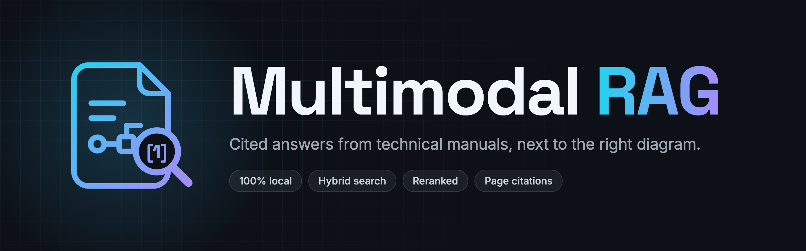

<p align="center">
  
</p>

<p align="center">
  <a href="https://github.com/Tjimenez1303/multimodal-rag-system/actions/workflows/ci.yml"></a>
  <a href="LICENSE"></a>
  <a href="https://www.python.org/downloads/"></a>
</p>

Ask questions about technical PDF manuals and get answers that cite the page they come
from, next to the diagram they refer to.

Technical manuals mix running text with tables, wiring diagrams, exploded views and
scanned pages. This project reads all of it, keeps track of where every piece sits on
its page, and indexes it so an answer can point back to the right page and figure. It
runs entirely on your machine, including the models.

Open the chat in your browser, upload a manual and ask it a question. Each answer lists
its sources by document and page and shows the figure it relies on beside the text.

## Demo

A walkthrough of the architecture, uploading a manual, and asking questions whose answers
cite their page and show the figure they rely on.

https://github.com/user-attachments/assets/23bcd737-6e99-433a-9d1b-c472452cfcde

## Features

- Uploads return a job id right away, while a separate worker processes the document
  in the background.
- Every job reports its stage and page progress. A job interrupted by a crash is
  picked up again automatically, with up to three attempts in total.
- Text, tables and images are extracted with their page and position. Scanned pages
  go through text recognition in English and Spanish.
- A local vision model describes each relevant diagram, so a figure can be found by
  what it shows or by a label printed inside it.
- Content is split along headings, tables and figures, never in the middle of a
  sentence or a table. Tables that continue on the next page stay together.
- Every unit is indexed for both semantic and exact keyword search, which matters for
  part numbers and valve codes.
- Questions are answered only from the ingested manuals. Each statement carries a
  numbered citation to the document and page it comes from, and the response lists every
  passage the answer was built from.
- A local reranker reads the question next to each retrieved passage and judges whether
  the passage answers it, so a label typed on its own, such as "Total Neto", finds its
  page, and the best passages reach the answer model first.
- When the manuals do not contain the answer, the response says so instead of guessing.
  A question they do not answer is stopped in about two seconds, before the answer
  model.
- An answer that relies on a diagram comes with the figure closest to the cited text,
  its page and its caption. Tables among the sources come with their rows.
- Questions can be asked in English or Spanish about manuals in either language. Codes
  and values keep the form they have in the manual.
- A slow or unavailable model fails with an error that names it, within a fixed
  deadline, while uploads keep working. A client that disconnects cancels its question.
- In the chat, every numbered marker leads to its source line, each source opens the
  original page of the PDF, and sources recognized from a scan with low confidence are
  marked for checking.
- The figure an answer depends on sits next to it, with its caption and page, and opens
  at full size.
- Failures explain what went wrong in plain words, with a reference to find the request
  in the logs and a retry.
- The document panel uploads manuals and follows their processing, page by page, until
  they are ready to be asked about. A ready manual can be read page by page, and a
  manual that is no longer needed can be deleted with everything captured from it.

## Architecture


The chat client is a React application served by nginx, which also forwards API calls,
so the browser only ever talks to one address. The API accepts uploads, answers status
queries and questions, and serves figures and pages. Heavy work happens in the worker,
which you can scale out with more replicas. PostgreSQL stores documents and extracted
elements and also acts as the job queue. Qdrant holds the searchable units, and Docker
Model Runner serves the vision and answer model, the embedding model and the reranker on
the host GPU.

A question is embedded and searched by meaning and by keywords. The reranker judges how
likely each of the 16 best passages is to contain the answer, and the 8 best judged go to
the answer model, which is asked only when one of them is judged likely enough. The
citations in the answer are then checked against the passages the model was given, so an
answer can never cite a page that was not retrieved.

The diagram is an editable draw.io file. Open it in [draw.io](https://app.diagrams.net)
to change it. Its other pages draw the backend, the frontend and the database in detail.

## Documentation

- [Backend developer guide](docs/backend/README.md): layers, request flows, a codemap of
  every module, the data model, and recipes for common changes
- [Frontend developer guide](docs/frontend/README.md): boot sequence, feature folders,
  state and errors, a codemap, and recipes for common changes
- [Architecture decision records](docs/adr)

## Requirements

- Docker Desktop with at least 12 CPUs and 20 GB of memory, and about 15 GB of free
  disk for images and models
- Docker Model Runner, enabled once per machine:

  ```bash
  docker desktop enable model-runner --tcp 12434 --cors none
  ```

  On Linux, install the `docker-model-plugin` package instead.
- [uv](https://docs.astral.sh/uv/) if you want to run the tests

## Getting started

Clone the repository and start the stack:

```bash
git clone https://github.com/Tjimenez1303/multimodal-rag-system.git
cd multimodal-rag-system
cp .env.example .env
docker compose up -d --build --wait
```

The first start builds the images and downloads the models, about 8.4 GB in total.
When it finishes, open the chat at http://localhost:3000. Upload a manual from the
document panel, wait until it shows as ready, and ask a question about it.

The API is also available directly at http://localhost:8000, with its interactive
documentation at http://localhost:8000/docs.

Coming from a version without page images? Recreate the stored data once, then upload
the manuals again:

```bash
docker compose down -v
docker compose up -d --build --wait
```

## Usage

The chat at http://localhost:3000 covers everyday use:

- Type a question and press Enter. Shift+Enter starts a new line, and the send button
  becomes a stop button while an answer is prepared.
- Activate a numbered marker to jump to its source, and open a source's page or a
  figure at full size.
- Collapse the document panel to give the conversation the whole width. It keeps a
  count of the manuals still processing.
- Choose "View document" on a ready manual to page through it, or "Delete" on a ready or
  failed one to remove it. A manual still processing cannot be deleted until it ends.
- The conversation survives a reload of the tab and is cleared when the tab closes or
  you start a new conversation.

The same service can be scripted over HTTP:

```bash
curl -F file=@manual.pdf http://localhost:8000/api/v1/documents
curl http://localhost:8000/api/v1/jobs/<job_id>
curl -H 'Content-Type: application/json' \
  -d '{"question": "How is a shunt generator wired?"}' \
  http://localhost:8000/api/v1/questions
```

The upload answers with a `job_id` and a `document_id`. The job moves from `pending` to
`processing` to `completed`, and a completed job includes a summary of what was
captured.

The answer marks each statement with the number of its citation, and names the figure it
relies on. The response below is trimmed to one source:

```json
{
  "status": "answered",
  "reason": null,
  "answer": "A shunt generator has a field winding connected in parallel with the external circuit [1]. The output voltage of a shunt generator can be controlled by inserting a rheostat in series with the field windings [1].",
  "not_covered": null,
  "citations": [
    {
      "number": 1,
      "document_name": "faa-powerplant-ch4-ignition-electrical.pdf",
      "pages": [12]
    }
  ],
  "sources": [
    {
      "rank": 1,
      "document_name": "faa-powerplant-ch4-ignition-electrical.pdf",
      "section": ["Reciprocating Engine Ignition Systems", "Parallel (Shunt) Wound DC Generators"],
      "pages": [12],
      "content_type": "figure",
      "cited": true,
      "citation_number": 1,
      "generated_description": true
    }
  ],
  "primary_image": {
    "page": 12,
    "caption": "Figure 4-22. Shunt wound generator.",
    "url": "/api/v1/documents/5d3ff0f9-f671-4a1b-b3e6-3258071fa024/images/d9b34abe-b2e5-52e8-8b3a-96a9c9ccf6cb"
  },
  "related_images": []
}
```

When the manuals do not cover the question, `status` is `not_enough_information`,
`reason` says why, and there are no citations or images. The full response schema is in
the interactive documentation.

| Endpoint | Description |
|---|---|
| `POST /api/v1/documents` | Upload a PDF. Uploading the same file twice returns the existing document |
| `GET /api/v1/jobs/{job_id}` | State, stage, page progress and summary of a job |
| `GET /api/v1/documents` | Document library, newest first, with the latest job of each document |
| `GET /api/v1/documents/{document_id}` | One document and its latest job |
| `DELETE /api/v1/documents/{document_id}` | Delete a document and everything captured from it, unless it is still processing |
| `GET /api/v1/documents/{document_id}/elements` | Extracted text, tables and images, filterable by page and kind |
| `GET /api/v1/documents/{document_id}/images/{element_id}` | The image of a figure |
| `GET /api/v1/documents/{document_id}/pages/{page_number}/image` | The rendered page, once the document is ready |
| `POST /api/v1/questions` | Answer a question with citations, sources and the related figure |

Every setting lives in [`.env.example`](.env.example) with its default. Two you will
probably want:

- `FIGURE_DESCRIPTION_ENABLED=false` skips the vision model, which makes ingestion
  several times faster.
- `docker compose up -d --scale worker=2` adds a second worker.
- `FRONTEND_PUBLISHED_PORT` changes the chat's port, 3000 by default.

Question answering has its own settings, all with defaults:

| Setting | Default | What it controls |
|---|---|---|
| `RETRIEVAL_TOP_K` | 8 | Passages given to the answer model |
| `RERANK_CANDIDATES` | 16 | Passages the reranker judges, of which the best go to the answer model |
| `MIN_RELEVANCE` | 0.30 | How likely a passage must be to answer the question, as the reranker judges it, before the model is asked |
| `ANSWER_CONCURRENCY` | 2 | Questions answered at the same time |
| `ANSWER_QUEUE_LIMIT` | 6 | Questions waiting. Further ones get `answering_busy` with `Retry-After` |
| `ANSWER_DEADLINE_SECONDS` | 90 | Longest time a question may take, waiting included |

To stop the stack, run `docker compose down`. Add `-v` to delete the stored data as
well.

## Sample documents

These three public manuals were used to test and measure the system. Download them to
try it out:

| Document | Pages | Language | License |
|---|---|---|---|
| [FAA-H-8083-32B, Chapter 4: Engine Ignition and Electrical Systems](https://www.faa.gov/sites/faa.gov/files/06_amtp_ch4.pdf) | 71 | English | US public domain |
| [INSST, Guía técnica para la evaluación y prevención del riesgo eléctrico](https://www.insst.es/documentacion/catalogo-de-publicaciones/guia-tecnica-para-la-evaluacion-y-prevencion-de-los-riesgos-relacionados-con-la-proteccion-frente-al-riesgo-electrico) | 86 | Spanish | Free reuse citing the source |
| [US Army TM 5-3431-201-10, Welding Machine operator's manual](https://archive.org/details/TM5-3431-201-10) | 65, scanned | English | Public Domain Mark |

On an Apple M4 Pro, ingesting them with figure descriptions took 11.5, 6.5 and 8.7
minutes. Without descriptions a digital page takes about 1.5 seconds and a scanned page
about 3 seconds.

## Development

The backend is a Python 3.14 project managed with uv, and the chat client a TypeScript
project on Node 24 managed with npm. From the repository root:

```bash
uv sync --project backend
npm --prefix frontend ci
uv run --project backend pre-commit install
```

Run the client against a local API, with hot reload, at http://localhost:5173:

```bash
npm --prefix frontend run dev
```

Run the checks and the tests:

```bash
uv run --project backend pre-commit run --all-files
uv run --directory backend pytest --cov
npm --prefix frontend run test:coverage
npm --prefix frontend run test:e2e
```

Measure the relevance gate against labeled questions, on a running system with the
sample documents and `backend/tests/fixtures/labeled_total.pdf` uploaded:

```bash
uv run --directory backend python -m tests.evaluation.evaluate_relevance
```

The pre-commit hooks run ruff, mypy in strict mode, typos and the import boundary checks
for the backend, and oxlint, Prettier and the TypeScript compiler for the client. The
backend suite needs Docker running, because the integration tests start PostgreSQL and
Qdrant with testcontainers. The end-to-end tests drive Chromium, Firefox and WebKit with
Playwright, including accessibility checks. CI runs the same commands and fails below
90% coverage on either side.

## Design decisions

Each major decision has a record in [`docs/adr`](docs/adr):

1. [PostgreSQL as the ingestion job queue](docs/adr/0001-postgres-job-queue.md)
2. [Document extraction with Docling](docs/adr/0002-document-extraction-with-docling.md)
3. [Local models served by Docker Model Runner](docs/adr/0003-local-models-on-docker-model-runner.md)
4. [Structure-aware retrieval units](docs/adr/0004-structure-aware-retrieval-units.md),
   which describes the chunking strategy
5. [Grounded answers and a relevance gate](docs/adr/0005-grounded-answers-and-relevance-gate.md)
6. [A browser chat client served next to the API](docs/adr/0006-chat-client-stack-and-serving.md)
7. [Page images kept from ingestion](docs/adr/0007-page-images-at-ingestion.md)
8. [Deleting a document](docs/adr/0008-document-deletion.md)
9. [A reranker decides whether a question is answered](docs/adr/0009-reranked-relevance-gate.md)

The backend stack is FastAPI, SQLAlchemy with asyncpg, PostgreSQL 18, Qdrant 1.19 with
server-side BM25, Docling 2.130, and the Qwen3.5 9B, Qwen3 Embedding 0.6B and Qwen3
Reranker 0.6B models. The
same Qwen3.5 9B instance describes figures and writes answers. The chat client is React
19 with Vite, shadcn/ui and Vercel AI Elements, served by nginx. Specifications, research
notes and validation scenarios are in [`specs`](specs), one folder per feature:
[ingestion](specs/001-async-pdf-ingestion),
[question answering](specs/002-grounded-question-answering),
[the chat client](specs/003-visual-chat-client) and
[the reranked relevance gate](specs/004-reranked-relevance-gate).

## Contributing

Read [AGENTS.md](AGENTS.md) before opening a pull request. It covers the workflow, the
code conventions and the commit format.

## License

Licensed under the [Apache License 2.0](LICENSE).

## Acknowledgements

- Origen de los datos: INSST, for the electrical risk guide used in testing.
- [Docling](https://github.com/docling-project/docling) for layout-aware PDF extraction.
- [Qwen](https://github.com/QwenLM) for the vision, answer, embedding and reranking
  models.
- [RAGFlow](https://github.com/infiniflow/ragflow) and [Onyx](https://github.com/onyx-dot-app/onyx), whose
  citation handling shaped how answers are tied to their sources.
- [shadcn/ui](https://ui.shadcn.com) and [AI Elements](https://ai-sdk.dev/elements) for
  the chat interface.
