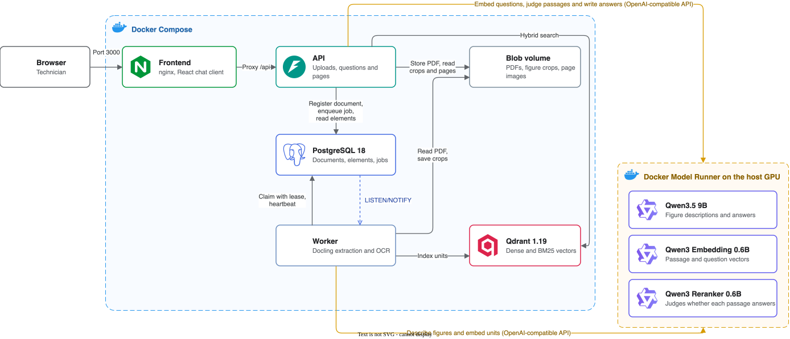

# Multimodal RAG System

[](https://github.com/Tjimenez1303/multimodal-rag-system/actions/workflows/ci.yml)
[](LICENSE)
[](https://www.python.org/downloads/)

Ask questions about technical PDF manuals and get answers that cite the page they come
from, next to the diagram they refer to.

Technical manuals mix running text with tables, wiring diagrams, exploded views and
scanned pages. This project reads all of it, keeps track of where every piece sits on
its page, and indexes it so an answer can point back to the right page and figure. It
runs entirely on your machine, including the models.

Document ingestion and question answering are ready. The chat client is under
development.

## Features

- Uploads return a job id right away, while a separate worker processes the document
  in the background.
- Every job reports its stage and page progress. A job interrupted by a crash is
  picked up again automatically, with up to three attempts in total.
- Text, tables and images are extracted with their page and position. Scanned pages
  go through text recognition in English and Spanish.
- A local vision model describes each relevant diagram, so a figure can be found by
  what it shows or by a label printed inside it.
- Content is split along headings, tables and figures, never in the middle of a
  sentence or a table. Tables that continue on the next page stay together.
- Every unit is indexed for both semantic and exact keyword search, which matters for
  part numbers and valve codes.
- Questions are answered only from the ingested manuals. Each statement carries a
  numbered citation to the document and page it comes from, and the response lists every
  passage the answer was built from.
- When the manuals do not contain the answer, the response says so instead of guessing,
  and a question unrelated to them is answered in under a tenth of a second.
- An answer that relies on a diagram comes with the figure closest to the cited text,
  its page and its caption. Tables among the sources come with their rows.
- Questions can be asked in English or Spanish about manuals in either language. Codes
  and values keep the form they have in the manual.
- A slow or unavailable model fails with an error that names it, within a fixed
  deadline, while uploads keep working. A client that disconnects cancels its question.

## Architecture



The API accepts uploads, reports job status and answers questions. Heavy work
happens in the worker, which you can scale out with more replicas. PostgreSQL stores
documents and extracted elements and also acts as the job queue. Qdrant holds the
searchable units, and Docker Model Runner serves both models on the host GPU.

A question is embedded, searched by meaning and by keywords, and sent to the answer model
only when a retrieved passage is relevant enough. The citations in the answer are then
checked against the passages the model was given, so an answer can never cite a page that
was not retrieved.

The diagram is an editable draw.io file. Open it in [draw.io](https://app.diagrams.net)
to change it.

## Requirements

- Docker Desktop with at least 12 CPUs and 20 GB of memory, and about 15 GB of free
  disk for images and models
- Docker Model Runner, enabled once per machine:

  ```bash
  docker desktop enable model-runner --tcp 12434 --cors none
  ```

  On Linux, install the `docker-model-plugin` package instead.
- [uv](https://docs.astral.sh/uv/) if you want to run the tests

## Getting started

Clone the repository and start the stack:

```bash
git clone https://github.com/Tjimenez1303/multimodal-rag-system.git
cd multimodal-rag-system
cp .env.example .env
docker compose up -d --build --wait
```

The first start builds the image and downloads the models, about 7.2 GB in total. When
it finishes, the API is available at http://localhost:8000 and its interactive
documentation at http://localhost:8000/docs.

Upload a manual and follow its progress:

```bash
curl -F file=@manual.pdf http://localhost:8000/api/v1/documents
curl http://localhost:8000/api/v1/jobs/<job_id>
```

The upload answers with a `job_id` and a `document_id`. The job moves from `pending` to
`processing` to `completed`, and a completed job includes a summary of what was
captured.

Once a job completes, ask a question:

```bash
curl -X POST http://localhost:8000/api/v1/questions \
  -H 'Content-Type: application/json' \
  -d '{"question": "How is a shunt generator wired?"}'
```

The answer marks each statement with the number of its citation, and names the figure it
relies on. The response below is trimmed to one source:

```json
{
  "status": "answered",
  "reason": null,
  "answer": "A shunt generator has a field winding connected in parallel with the external circuit [1]. The output voltage of a shunt generator can be controlled by inserting a rheostat in series with the field windings [1].",
  "not_covered": null,
  "citations": [
    {
      "number": 1,
      "document_name": "faa-powerplant-ch4-ignition-electrical.pdf",
      "pages": [12]
    }
  ],
  "sources": [
    {
      "rank": 1,
      "document_name": "faa-powerplant-ch4-ignition-electrical.pdf",
      "section": ["Reciprocating Engine Ignition Systems", "Parallel (Shunt) Wound DC Generators"],
      "pages": [12],
      "content_type": "figure",
      "cited": true,
      "citation_number": 1,
      "generated_description": true
    }
  ],
  "primary_image": {
    "page": 12,
    "caption": "Figure 4-22. Shunt wound generator.",
    "url": "/api/v1/documents/5d3ff0f9-f671-4a1b-b3e6-3258071fa024/images/d9b34abe-b2e5-52e8-8b3a-96a9c9ccf6cb"
  },
  "related_images": []
}
```

When the manuals do not cover the question, `status` is `not_enough_information`,
`reason` says why, and there are no citations or images. The full response schema is in
the interactive documentation.

## Usage

| Endpoint | Description |
|---|---|
| `POST /api/v1/documents` | Upload a PDF. Uploading the same file twice returns the existing document |
| `GET /api/v1/jobs/{job_id}` | State, stage, page progress and summary of a job |
| `GET /api/v1/documents` | Document library, newest first, with the latest job of each document |
| `GET /api/v1/documents/{document_id}` | One document and its latest job |
| `GET /api/v1/documents/{document_id}/elements` | Extracted text, tables and images, filterable by page and kind |
| `GET /api/v1/documents/{document_id}/images/{element_id}` | The image of a figure |
| `POST /api/v1/questions` | Answer a question with citations, sources and the related figure |

Every setting lives in [`.env.example`](.env.example) with its default. Two you will
probably want:

- `FIGURE_DESCRIPTION_ENABLED=false` skips the vision model, which makes ingestion
  several times faster.
- `docker compose up -d --scale worker=2` adds a second worker.

Question answering has its own settings, all with defaults:

| Setting | Default | What it controls |
|---|---|---|
| `RETRIEVAL_TOP_K` | 8 | Passages given to the answer model |
| `MIN_SIMILARITY` | 0.60 | How close a passage must be to the question before the model is asked |
| `ANSWER_CONCURRENCY` | 2 | Questions answered at the same time |
| `ANSWER_QUEUE_LIMIT` | 6 | Questions waiting. Further ones get `answering_busy` with `Retry-After` |
| `ANSWER_DEADLINE_SECONDS` | 90 | Longest time a question may take, waiting included |

To stop the stack, run `docker compose down`. Add `-v` to delete the stored data as
well.

## Sample documents

These three public manuals were used to test and measure the system. Download them to
try it out:

| Document | Pages | Language | License |
|---|---|---|---|
| [FAA-H-8083-32B, Chapter 4: Engine Ignition and Electrical Systems](https://www.faa.gov/sites/faa.gov/files/06_amtp_ch4.pdf) | 71 | English | US public domain |
| [INSST, Guía técnica para la evaluación y prevención del riesgo eléctrico](https://www.insst.es/documentacion/catalogo-de-publicaciones/guia-tecnica-para-la-evaluacion-y-prevencion-de-los-riesgos-relacionados-con-la-proteccion-frente-al-riesgo-electrico) | 86 | Spanish | Free reuse citing the source |
| [US Army TM 5-3431-201-10, Welding Machine operator's manual](https://archive.org/details/TM5-3431-201-10) | 65, scanned | English | Public Domain Mark |

On an Apple M4 Pro, ingesting them with figure descriptions took 11.5, 6.5 and 8.7
minutes. Without descriptions a digital page takes about 1.5 seconds and a scanned page
about 3 seconds.

## Development

The backend is a Python 3.14 project managed with uv. From the repository root:

```bash
uv sync --project backend
uv run --project backend pre-commit install
```

Run the checks and the tests:

```bash
uv run --project backend pre-commit run --all-files
uv run --directory backend pytest --cov
```

The pre-commit hooks run ruff, mypy in strict mode, typos and the import boundary
checks. The test suite needs Docker running, because the integration tests start
PostgreSQL and Qdrant with testcontainers. CI runs the same commands and fails below 90%
coverage.

## Design decisions

Each major decision has a record in [`docs/adr`](docs/adr):

1. [PostgreSQL as the ingestion job queue](docs/adr/0001-postgres-job-queue.md)
2. [Document extraction with Docling](docs/adr/0002-document-extraction-with-docling.md)
3. [Local models served by Docker Model Runner](docs/adr/0003-local-models-on-docker-model-runner.md)
4. [Structure-aware retrieval units](docs/adr/0004-structure-aware-retrieval-units.md),
   which describes the chunking strategy
5. [Grounded answers and a relevance gate](docs/adr/0005-grounded-answers-and-relevance-gate.md)

The stack is FastAPI, SQLAlchemy with asyncpg, PostgreSQL 18, Qdrant 1.19 with
server-side BM25, Docling 2.130, and the Qwen3.5 9B and Qwen3 Embedding 0.6B models.
The same Qwen3.5 9B instance describes figures and writes answers. Specifications,
research notes and validation scenarios are in [`specs`](specs), one folder per feature:
[ingestion](specs/001-async-pdf-ingestion) and
[question answering](specs/002-grounded-question-answering).

## Contributing

Read [AGENTS.md](AGENTS.md) before opening a pull request. It covers the workflow, the
code conventions and the commit format.

## License

Licensed under the [Apache License 2.0](LICENSE).

## Acknowledgements

- Origen de los datos: INSST, for the electrical risk guide used in testing.
- [Docling](https://github.com/docling-project/docling) for layout-aware PDF extraction.
- [Qwen](https://github.com/QwenLM) for the vision, answer and embedding models.
- [RAGFlow](https://github.com/infiniflow/ragflow) and [Onyx](https://github.com/onyx-dot-app/onyx), whose
  citation handling shaped how answers are tied to their sources.
