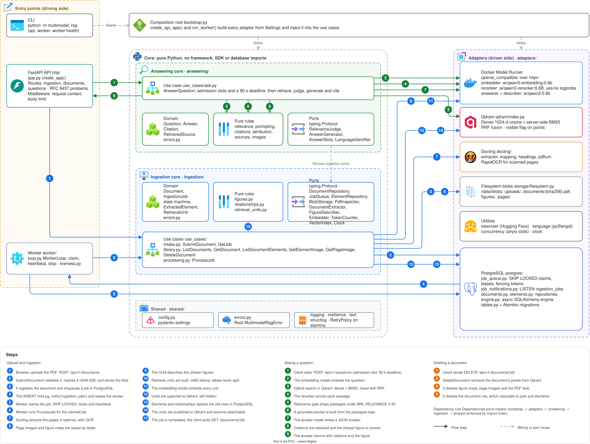

# Backend developer guide

The backend is one Python package, `multimodal_rag`, that runs as three processes: the
REST API, the ingestion worker and a one-shot migration. They share the same image and
the same code, and differ only in the command compose starts them with.



## Reading order

Start with the architecture, follow a request through the runtime flows, then use the
codemap as a reference while reading the code.

| Guide | What it answers |
| --- | --- |
| [Architecture](architecture.md) | How the code is layered, which rules hold everywhere and why |
| [Runtime flows](runtime-flows.md) | What happens, call by call, when a PDF is uploaded, a question is asked or a document is deleted |
| [Codemap](codemap.md) | What every folder and file holds, and its key symbols |
| [Data model](data-model.md) | Tables, constraints, the Qdrant collection and the blob keys |
| [Where to put what](where-to-put-what.md) | Which folder a new piece of code belongs in |
| [How-to guides](how-to.md) | Step-by-step recipes for the changes people make most often |
| [Testing](testing.md) | The test layers, the fakes and how to run each suite |

The decisions behind the design are recorded as [ADRs](../adr), and the specifications
of each feature are in [`specs`](../../specs).

## Quick reference

Run these from the repository root.

```bash
uv sync --project backend
uv run --directory backend python -m multimodal_rag api
uv run --directory backend python -m multimodal_rag worker
uv run --directory backend pytest --cov
uv run --directory backend lint-imports
uv run --directory backend alembic revision --autogenerate -m "<change>"
```

The API and the worker read their settings from environment variables. Outside Docker,
start PostgreSQL, Qdrant and Docker Model Runner first, and export the variables listed
in [`shared/config.py`](../../backend/src/multimodal_rag/shared/config.py).

## Diagrams

The [architecture drawing](../images/architecture.drawio.svg) is one draw.io file with
four pages: the system overview, the backend, the frontend and the database. Open it in
[draw.io](https://app.diagrams.net) to edit any page, then export the page again as SVG
next to it.
