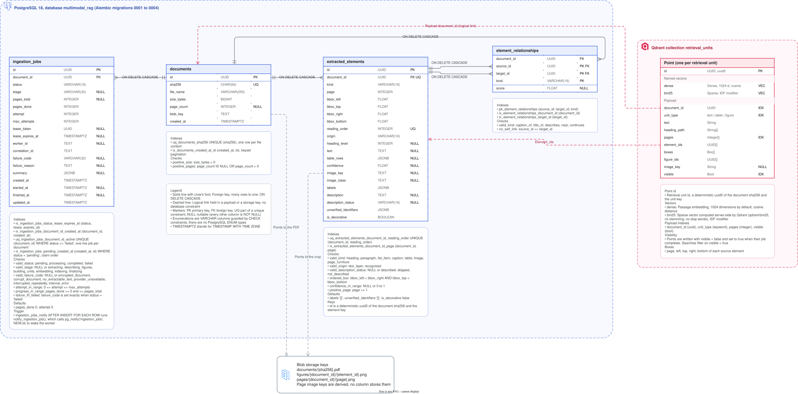

# Data model

The system keeps data in three places: PostgreSQL for documents, jobs and extracted
elements, Qdrant for the searchable retrieval units, and a blob volume for files.

The complete DDL, generated from the migrations, is in [`schema.sql`](schema.sql). The
schema is declared once with SQLAlchemy Core in
[`tables.py`](../../backend/src/multimodal_rag/adapters/postgres/tables.py), and Alembic
migrations create it. Enumerations are `VARCHAR` columns guarded by `CHECK` constraints
generated from the Python enums, so there are no PostgreSQL `ENUM` types to migrate.

## PostgreSQL

### `documents`

An uploaded PDF, identified by the SHA-256 of its bytes. Uploading the same file twice
finds the same row.

| Column | Type | Notes |
| --- | --- | --- |
| `id` | `UUID` | Primary key |
| `sha256` | `CHAR(64)` | Unique, the content fingerprint |
| `file_name` | `VARCHAR(255)` | Base name as uploaded |
| `size_bytes` | `BIGINT` | Positive |
| `page_count` | `INTEGER` | Null for encrypted PDFs, positive otherwise |
| `blob_key` | `TEXT` | `documents/{sha256}.pdf` |
| `created_at` | `TIMESTAMPTZ` | Sort key of the library |

The index on `(created_at, id)` serves keyset pagination, newest first.

### `ingestion_jobs`

One ingestion of a document. This table is also the job queue: workers claim rows from
it, and a trigger notifies them when a row is inserted.

| Column | Type | Notes |
| --- | --- | --- |
| `id` | `UUID` | Primary key, the `job_id` returned by an upload |
| `document_id` | `UUID` | Foreign key to `documents`, cascades on delete |
| `status` | `VARCHAR(16)` | `pending`, `processing`, `completed` or `failed` |
| `stage` | `VARCHAR(32)` | Current step while processing, such as `extracting` |
| `pages_total`, `pages_done` | `INTEGER` | Page progress |
| `attempt`, `max_attempts` | `INTEGER` | Attempts used and allowed |
| `lease_token`, `lease_expires_at` | `UUID`, `TIMESTAMPTZ` | The lease of the running attempt, used as a fencing token |
| `worker_id` | `TEXT` | Host and process of the worker holding the lease |
| `correlation_id` | `TEXT` | `X-Request-ID` of the upload, logged by the worker |
| `failure_code`, `failure_reason` | `VARCHAR(32)`, `TEXT` | Set exactly when the job failed |
| `summary` | `JSONB` | Counts of a completed job: pages, tables, images, units |
| `created_at`, `started_at`, `finished_at`, `updated_at` | `TIMESTAMPTZ` | Timeline |

Constraints and indexes that carry behavior:

- `uq_ingestion_jobs_document_id_active`, a partial unique index on `document_id` where
  `status <> 'failed'`, allows at most one live job per document. Enqueueing uses it as
  its `ON CONFLICT` target, so concurrent identical uploads share one job.
- `ix_ingestion_jobs_pending_created_at`, a partial index on `(created_at, id)` where
  `status = 'pending'`, serves the claim, which takes the oldest pending job first.
- `ix_ingestion_jobs_status_lease_expires_at` helps find processing jobs whose lease
  expired.
- `ck_ingestion_jobs_failure_iff_failed` keeps `failure_code` set exactly when the status
  is `failed`. Other checks keep the attempt and the page progress in range.
- The trigger `ingestion_jobs_notify` runs `pg_notify('ingestion_jobs', id)` after every
  insert, which wakes idle workers without waiting for their poll.

### `extracted_elements`

Every piece of content taken from a page: a heading, a paragraph, a list item, a
caption, a table, an image or page furniture such as a running header.

| Column | Type | Notes |
| --- | --- | --- |
| `id` | `UUID` | Primary key, a UUIDv5 of the document fingerprint and the reading order |
| `document_id` | `UUID` | Foreign key to `documents`, cascades on delete |
| `kind` | `VARCHAR(16)` | Element kind |
| `page` | `INTEGER` | Page number, from 1 |
| `bbox_left`, `bbox_top`, `bbox_right`, `bbox_bottom` | `FLOAT` | Position in PDF points, top-left origin |
| `reading_order` | `INTEGER` | Unique per document |
| `origin` | `VARCHAR(16)` | `text_layer` or `recognized` (OCR) |
| `heading_level` | `INTEGER` | Headings only |
| `text` | `TEXT` | Text, or the Markdown of a table |
| `table_rows` | `JSONB` | Cell grid of a table |
| `confidence` | `FLOAT` | OCR confidence of recognized text |
| `image_key`, `image_class`, `labels`, `description`, `description_status`, `unverified_identifiers`, `is_decorative` | | Image fields: the crop, the classifier's class, printed labels and the vision model's description |

The index on `(document_id, page)` serves page filters, and the unique constraint on
`(document_id, reading_order)` keeps the order consistent.

### `element_relationships`

Links between two elements of a document: a caption to its figure (`caption_of`) or
table (`title_of`), a paragraph near a figure (`near`), a table continued on the next
page (`continues`).

The primary key is `(source_id, target_id, kind)`, and both ids are foreign keys to
`extracted_elements`. An element can never link to itself. The primary key serves
lookups by source, and `ix_element_relationships_target_id` serves lookups by target.

## Qdrant

One collection, `retrieval_units` by default, holds one point per retrieval unit.

| Part | Content |
| --- | --- |
| Point id | The unit id, a UUIDv5 of the document fingerprint and the unit key |
| `dense` vector | 1024 dimensions from the embedding model, cosine distance |
| `bm25` sparse vector | Computed by Qdrant from the unit text, with IDF weighting, lowercase and accent folding, no stemming and no stop words, so part numbers match exactly in any language |
| Payload | `document_id`, `unit_type`, `text`, `heading_path`, `pages`, `element_ids`, `boxes`, `figure_ids`, `image_key`, `visible` |

`document_id`, `unit_type`, `pages` and `visible` have payload indexes. Units are written
with `visible: false` and switched to `true` only after their elements are stored in
PostgreSQL, so a search never finds a unit whose elements are missing.

## Blob storage

Files live under `BLOB_ROOT`, a volume mounted in the API and the worker. Keys are
derived from ids, so nothing needs to be looked up to find a file.

| Key | Content |
| --- | --- |
| `uploads/{random}.pdf` | Staging copy while an upload is checked |
| `documents/{sha256}.pdf` | The original PDF |
| `pages/{document_id}/{page}.png` | Every page rendered at 144 dpi during ingestion |
| `figures/{document_id}/{element_id}.png` | The crop of each image element |

## Changing the schema

Edit `tables.py`, then generate and review a migration, as described in the
[how-to guides](how-to.md#change-the-database-schema).
