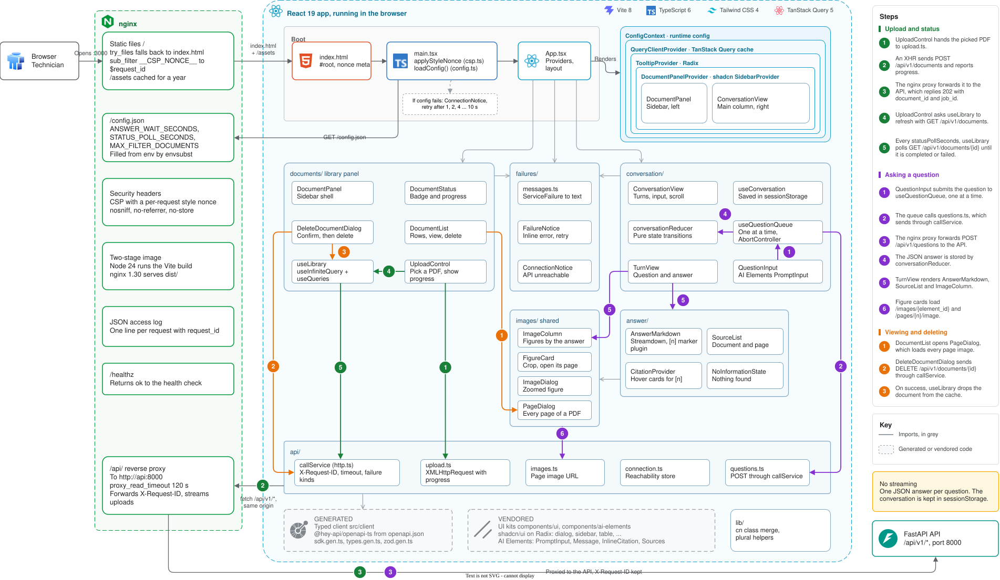

# Frontend developer guide

The chat client is a React 19 single-page application written in TypeScript, built with
Vite and served by nginx, which also proxies the API so the browser talks to one origin.
Users upload PDF manuals in a side panel, follow their processing, and ask questions in
a conversation that shows answers with numbered citations, source passages and figures.



## Reading order

| Guide | What it answers |
| --- | --- |
| [Architecture](architecture.md) | How the app boots, how it is served, and how the feature folders depend on each other |
| [Runtime flows](runtime-flows.md) | What happens, component by component, when a user uploads, asks or deletes |
| [State and errors](state-and-errors.md) | Where each piece of state lives and how failures become messages |
| [Codemap](codemap.md) | What every folder and file holds |
| [Where to put what](where-to-put-what.md) | Which folder a new piece of code belongs in |
| [How-to guides](how-to.md) | Recipes for common changes |
| [Testing](testing.md) | Unit, component and end-to-end tests |

The decision behind the stack is recorded in
[ADR 0006](../adr/0006-chat-client-stack-and-serving.md), and the specification is in
[`specs/003-visual-chat-client`](../../specs/003-visual-chat-client).

## Quick reference

Node 24 is required (see `frontend/.node-version`). From the repository root:

```bash
npm --prefix frontend ci
npm --prefix frontend run dev
npm --prefix frontend run lint
npm --prefix frontend run typecheck
npm --prefix frontend run test:coverage
npm --prefix frontend run test:e2e
npm --prefix frontend run generate-client
```

`npm run dev` serves the client with hot reload at http://localhost:5173 and proxies
`/api` to an API on port 8000.

## Stack

| Concern | Library |
| --- | --- |
| UI | React 19, TypeScript 6 in strict mode |
| Build | Vite 8 |
| Styling | Tailwind CSS 4 |
| Components | shadcn/ui on Radix, and Vercel AI Elements for the chat pieces |
| Markdown | Streamdown, with sanitizing and two plugins of our own |
| Server state | TanStack Query 5, for the document library |
| API client | Generated from the OpenAPI contract by `@hey-api/openapi-ts`, validated with zod |
| Tests | Vitest, Testing Library and MSW, Playwright with axe |
| Lint and format | oxlint, Prettier |
